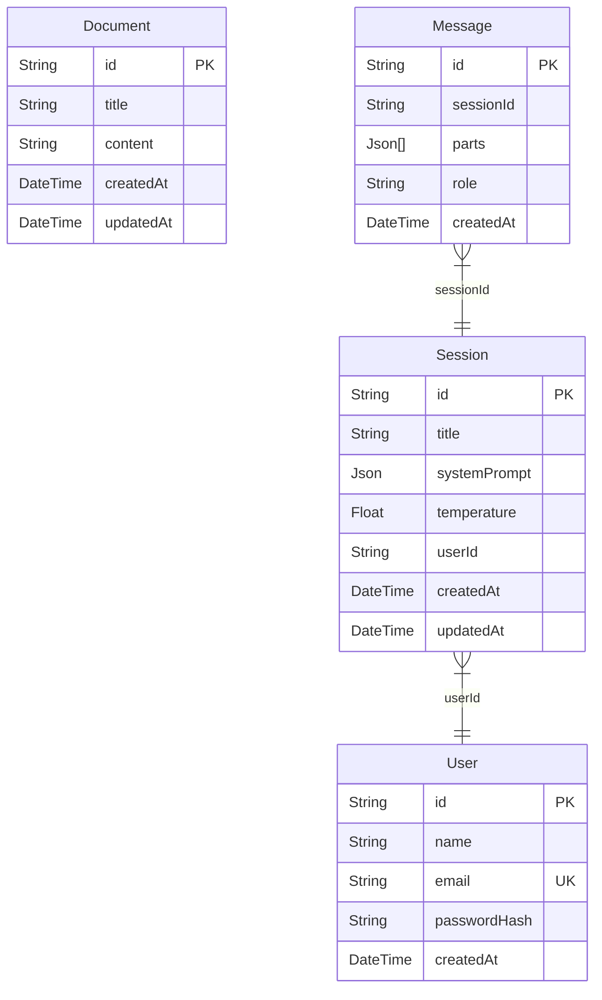

# Database ERD

```mermaid
erDiagram
  Document {
    String id PK
    String title
    String content
    DateTime createdAt
    DateTime updatedAt
  }
  Message {
    String id PK
    String sessionId
    Json[] parts
    String role
    DateTime createdAt
  }
  Session {
    String id PK
    String title
    Json systemPrompt
    Float temperature
    String userId
    DateTime createdAt
    DateTime updatedAt
  }
  User {
    String id PK
    String name
    String email UK
    String passwordHash
    DateTime createdAt
  }
  Message }|--|| Session : "sessionId"
  Session }|--|| User : "userId"
```
